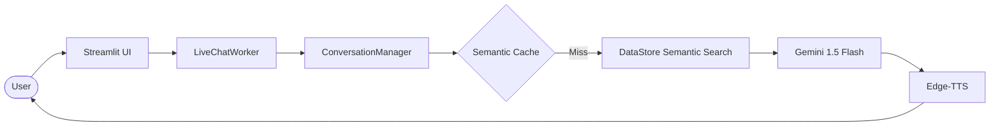

# THD University Assistant - Complete Feature Guide

> **A comprehensive walkthrough of the AI-powered admissions ecosystem**

This guide explains the project's capabilities, technical highlights, and how it delivers accurate info to prospective students.

---

## 📖 Table of Contents

1. [Project Overview](#project-overview)
2. [How It Works](#how-it-works)
3. [Key Features](#key-features)
4. [Technical Architecture](#technical-architecture)
5. [Data Flow](#data-flow)
6. [Data Integrity](#data-integrity)

---

## Project Overview

### What Is This?

The THD University Assistant is a **next-generation conversational AI** built for Technische Hochschule Deggendorf (THD). It transforms static program documentation into an interactive, voice-enabled assistant.

**Core Stats:**
- 🎤 **Hybrid Voice Interaction** - Standard and hands-free Live Chat modes.
- 🧠 **RAG Intelligence** - retrieval-augmented generation using **Gemini 1.5 Flash**.
- 📚 **Knowledge Base** - Deep integration with 93 YAML-defined university programs.
- 🌐 **Real-time Grounding** - Connected to Google Search for external university facts.
- ⚡ **Zero-Latency Caching** - Semantic caching for instant repeat answers.

---

## How It Works

### The User Journey

1. **Ask**: User speaks or types a query (e.g., "What are the fees for Cyber Security?").
2. **Retrieve**: The system performs a semantic search across all 93 programs to find the most relevant data points.
3. **Reason**: Gemini 1.5 Flash analyzes the retrieved data alongside the user's specific student category (Domestic, EU, or International).
4. **Answer**: The bot generates a natural, grounded response and speaks it back using neural TTS.

---

## Key Features

### 1. Adaptive AI Responses
The assistant doesn't just read data; it adapts.
- **Concise Mode**: Short 1-2 sentence answers for basic facts.
- **Detailed Mode**: Structured, multi-point explanations for complex application steps.

### 2. Live Voice Chat (Hands-Free)
Powered by `LiveChatWorker`, this mode allows for a continuous conversation. The bot listens for silence, processes the input, speaks the answer, and immediately resumes listening, creating a "Siri-like" experience.

### 3. Smart Program Search
A dedicated UI for filtering 93 programs by:
- Degree Level (Bachelor/Master)
- Language (English/German)
- Faculty & Field of Study
- ECTS and Duration

### 4. Semantic Response Cache
By using vector embeddings, the bot can recognize that "How much does it cost?" and "What are the tuition fees?" refer to the same intent. It serves cached answers in <100ms, bypassing the LLM for known queries.

---

## Technical Architecture

### The Tech Stack
- **Frontend**: Streamlit 1.30+ (Multi-page Web App)
- **LLM**: Google Gemini 1.5 Flash
- **RAG Engine**: Sentence Transformers (`paraphrase-multilingual-MiniLM-L12-v2`)
- **STT**: SpeechRecognition + Google Web Speech API
- **TTS**: Microsoft Edge-TTS (Neural Voices)
- **Persistence**: Local JSON-based session management

---

## Data Flow

---

## Data Integrity

The project maintains a rigorous standard for its knowledge base:
- **Systematic Validation**: `src/utils/validate_data.py` ensures all 93 YAML files are schema-compliant.
- **850+ Tests**: A comprehensive suite of unit, contract, and data quality tests verifies the bot's accuracy and stability before every update.

---
**Version:** 2.2.0
**Last Updated:** 2026-06-09
